# Schema Classi CSS e Tag HTML

## 📊 Dipendenze Principali

```mermaid
graph LR
    subgraph HTML["🌐 FILE HTML"]
        direction LR
        HOME["home.html"]
        MENU["menu.html"]
        PRENOTA["prenota.html"]
    end

    subgraph CSS["📄 FILE CSS"]
        direction LR
        STYLE["style.css"]
        MENUCSS["menu.css"]
    end

    subgraph FRAGMENTS["📋 FRAGMENTS"]
        direction LR
        HEADER["header.html"]
        FOOTER["footer.html"]
    end

    HOME --> STYLE
    MENU --> STYLE
    MENU --> MENUCSS
    PRENOTA --> STYLE

    HOME --> HEADER
    MENU --> HEADER
    PRENOTA --> HEADER

    HOME --> FOOTER
    MENU --> FOOTER
    PRENOTA --> FOOTER

    style HTML fill:#e1f5ff
    style CSS fill:#fff3e0
    style FRAGMENTS fill:#f3e5f5
```

## 📋 Tabella Riepilogativa CSS

### app.css
| Classe | Tag HTML |
|--------|----------|
| `.page` | div |
| `.btn` | a, button |
| `.status` | span, div |

### menu.css
| Classe | Tag HTML |
|--------|----------|
| `.menu-page` | main |
| `.menu-container` | div |
| `.menu-subtitle` | p |
| `.menu-section` | section |
| `.dish-list` | ul |
| `.dish-item` | li |
| `.dish-info` | div |
| `.dish-name` | span |
| `.dish-dots` | span |
| `.dish-price` | span |
| `.dish-description` | p |

### style.css
| Classe | Tag HTML |
|--------|----------|
| `.navbar` | nav |
| `.logo` | div |
| `.nav-links` | ul |
| `.home` | section |
| `.home-content` | div |
| `.btn-main` | a |
| `.welcome` | section |
| `.container-welcome` | div |
| `.welcome-text` | div |
| `.welcome-image` | div |
| `.img-wrapper` | div |
| `.btn-secondary` | a |
| `.section-intro` | section |
| `.footer` | footer |
| `.footer-links` | div, ul |

## 🎯 Dettaglio File HTML

### home.html
- **CSS importati**: style.css
- **Fragment inclusi**: header.html, footer.html
- **Classi CSS principali**:
  - `.navbar`, `.logo`, `.nav-links` (da header)
  - `.home`, `.home-content`, `.btn-main`
  - `.welcome`, `.container-welcome`, `.welcome-text`
  - `.welcome-image`, `.img-wrapper`, `.btn-secondary`
  - `.section-intro`
  - `.footer`, `.footer-links` (da footer)

### menu.html
- **CSS importati**: style.css, menu.css
- **Fragment inclusi**: header.html, footer.html
- **Classi CSS principali**:
  - `.navbar`, `.logo`, `.nav-links` (da header - style.css)
  - `.menu-page`, `.menu-container`, `.menu-subtitle`
  - `.menu-section`, `.dish-list`, `.dish-item`
  - `.dish-info`, `.dish-name`, `.dish-dots`, `.dish-price`, `.dish-description`
  - `.footer`, `.footer-links` (da footer - style.css)

### prenota.html
- **CSS importati**: style.css
- **Fragment inclusi**: header.html, footer.html
- **Classi CSS principali**:
  - `.navbar`, `.logo`, `.nav-links` (da header)
  - `.footer`, `.footer-links` (da footer)

### Fragment: header.html
- **CSS importati**: style.css
- **Classi CSS utilizzate**: `.navbar`, `.logo`, `.nav-links`
- **Incluso da**: home.html, menu.html, prenota.html

### Fragment: footer.html
- **CSS importati**: style.css (inline nel file)
- **Classi CSS utilizzate**: `.footer`, `.footer-links`
- **Incluso da**: home.html, menu.html, prenota.html
