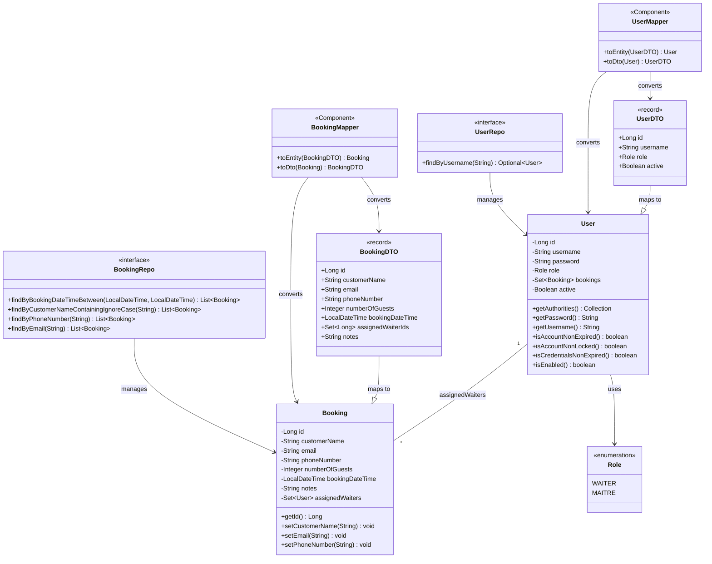

# JavaBistrot - UML Class Diagram

## Descrizione dei Componenti

### Entità (Entities)
- **User**: Rappresenta un utente del sistema (cameriere o maître). Implementa `UserDetails` per la sicurezza Spring.
- **Booking**: Rappresenta una prenotazione al ristorante.
- **Role**: Enum che definisce i ruoli disponibili (WAITER, MAITRE).

### DTO (Data Transfer Objects)
- **UserDTO**: Record per trasferire dati utente tra client e server.
- **BookingDTO**: Record per trasferire dati di prenotazione tra client e server.

### Mapper
- **UserMapper**: Converte tra `User` e `UserDTO`.
- **BookingMapper**: Converte tra `Booking` e `BookingDTO`.

### Repository
- **UserRepo**: Interfaccia JpaRepository per operazioni CRUD su User.
- **BookingRepo**: Interfaccia JpaRepository per operazioni CRUD su Booking con query personalizzate.

### Relazioni
- Una **Booking** è assegnata a **User** (relazione ManyToMany)
- **User** utilizza **Role** come enum
- I Mapper convertono tra Entity e DTO
- I Repository gestiscono l'accesso ai dati
