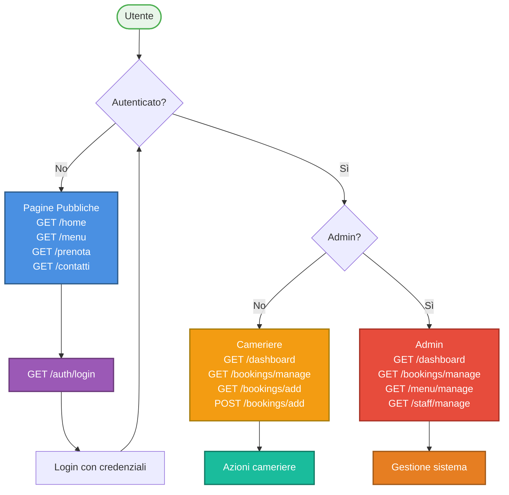

# API Routing - Nebbia&Zafferano

Documentazione delle rotte MVC (Thymeleaf) e API REST dell'applicazione Nebbia&Zafferano.

## Pagine Pubbliche (Public Pages)

| Pagina | Rotta | Controller#method | Ruolo | Metodo | Note |
|--------|-------|------------------|-------|--------|------|
| Home | GET / | PublicController#redirectToHome | Public | GET | Reindirizza a /home |
| Home | GET /home | PublicController#getHome | Public | GET | Homepage con welcome |
| Menu | GET /menu | PublicController#getMenu | Public | GET | Visualizza menu piatti |
| Prenotazioni | GET /prenota | PublicController#getBooking | Public | GET | Form prenotazioni |
| Contatti | GET /contatti | PublicController#getContacts | Public | GET | Pagina contatti |

## Autenticazione (Authentication)

| Pagina | Rotta | Controller#method | Ruolo | Metodo | Note |
|--------|-------|------------------|-------|--------|------|
| Login | GET /auth/login | LoginController#login | Public | GET | Form login con errorMessage |
| Dashboard | GET /dashboard | LoginController#dashboard | USER,ADMIN | GET | Home personalizzata per utente loggato |

## Pagine Private - Prenotazioni (Bookings)

| Pagina | Rotta | Controller#method | Ruolo | Metodo | Note |
|--------|-------|------------------|-------|--------|------|
| Gestione Prenotazioni | GET /bookings/manage | BookingManageController#manageBookings | USER,ADMIN | GET | Lista prenotazioni |
| Aggiungi Prenotazione | GET /bookings/add | BookingManageController#addBooking | USER,ADMIN | GET | Form creazione prenotazione |
| Crea Prenotazione | POST /bookings/add | BookingManageController#saveBooking | USER,ADMIN | POST | Salva nuova prenotazione |
| Modifica Prenotazione | GET /bookings/edit | BookingManageController#editBooking | USER,ADMIN | GET | Form modifica prenotazione |
| Aggiorna Prenotazione | POST /bookings/update | BookingManageController#updateBooking | USER,ADMIN | POST | Salva modifiche prenotazione |
| Elimina Prenotazione | POST /bookings/delete | BookingManageController#deleteBooking | USER,ADMIN | POST | Elimina prenotazione |

## Pagine Private - Menu (Dishes)

| Pagina | Rotta | Controller#method | Ruolo | Metodo | Note |
|--------|-------|------------------|-------|--------|------|
| Gestione Menu | GET /menu/manage | MenuManageController#manageMenu | ADMIN | GET | Lista piatti organizzati per tipo |
| Aggiungi Piatto | GET /menu/add | MenuManageController#addDish | ADMIN | GET | Form creazione nuovo piatto |
| Crea Piatto | POST /menu/add | MenuManageController#saveDish | ADMIN | POST | Salva nuovo piatto |
| Modifica Piatto | GET /menu/edit | MenuManageController#editDish | ADMIN | GET | Form modifica piatto |
| Aggiorna Piatto | POST /menu/update | MenuManageController#updateDish | ADMIN | POST | Salva modifiche piatto |
| Elimina Piatto | POST /menu/delete | MenuManageController#deleteDish | ADMIN | POST | Elimina piatto |

## Pagine Private - Staff (Users)

| Pagina | Rotta | Controller#method | Ruolo | Metodo | Note |
|--------|-------|------------------|-------|--------|------|
| Gestione Staff | GET /staff/manage | StaffController#manageStaff | ADMIN | GET | Lista camerieri e maîtres |
| Aggiungi Staff | GET /staff/add | StaffController#addStaff | ADMIN | GET | Form creazione nuovo staff |
| Crea Staff | POST /staff/add | StaffController#saveStaff | ADMIN | POST | Salva nuovo utente |
| Modifica Staff | GET /staff/edit | StaffController#editStaff | ADMIN | GET | Form modifica staff |
| Aggiorna Staff | POST /staff/update | StaffController#updateStaff | ADMIN | POST | Salva modifiche staff |
| Elimina Staff | POST /staff/delete | StaffController#deleteStaff | ADMIN | POST | Elimina staff |

---

## API REST - Prenotazioni

| Endpoint | Rotta | Controller#method | Ruolo | Metodo | Note |
|----------|-------|------------------|-------|--------|------|
| Crea Prenotazione | POST /api/bookings/addbooking | BookingRESTController#createBooking | USER,ADMIN | POST | Parametri: customerName, email, phoneNumber, numberOfGuests, bookingDateTime, notes |
| Aggiorna Prenotazione | POST /api/bookings/updatebooking | BookingRESTController#updateBooking | USER,ADMIN | POST | Parametri: id, ... |
| Elimina Prenotazione | POST /api/bookings/removebooking | BookingRESTController#deleteBooking | USER,ADMIN | POST | Parametri: id |

## API REST - Utenti

| Endpoint | Rotta | Controller#method | Ruolo | Metodo | Note |
|----------|-------|------------------|-------|--------|------|
| Crea Utente | POST /api/users/create | UserRESTController#createUser | ADMIN | POST | Parametri: username, password, role |
| Aggiorna Utente | POST /api/users/update | UserRESTController#updateUser | ADMIN | POST | Parametri: id, ... |
| Elimina Utente | POST /api/users/delete | UserRESTController#deleteUser | ADMIN | POST | Parametri: id |
| Recupera Utenti | GET /api/users | UserRESTController#getUsers | ADMIN | GET | Ritorna lista utenti |

---

## Legenda Ruoli

| Ruolo | Descrizione |
|-------|-------------|
| **Public** | Accessibile senza autenticazione |
| **USER** | Cameriere autenticato |
| **ADMIN** | Maître/Admin del sistema |
| **USER,ADMIN** | Accessibile da camerieri e admin |

---

## Diagramma Flusso Navigazione

