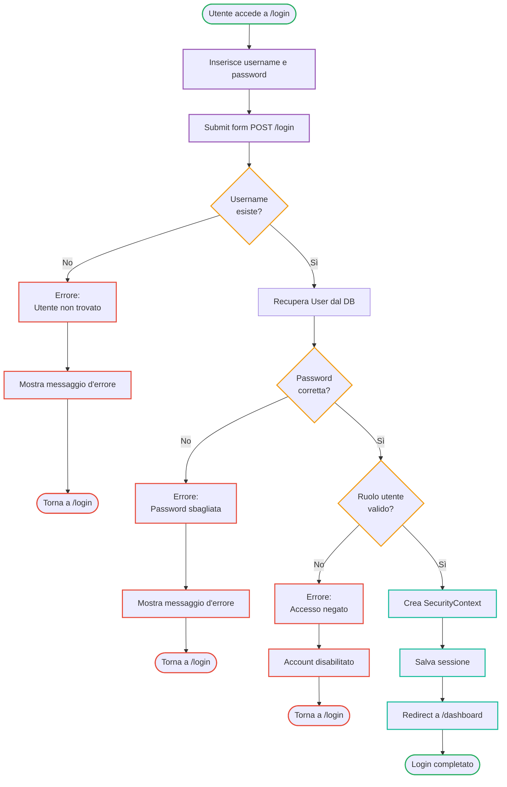
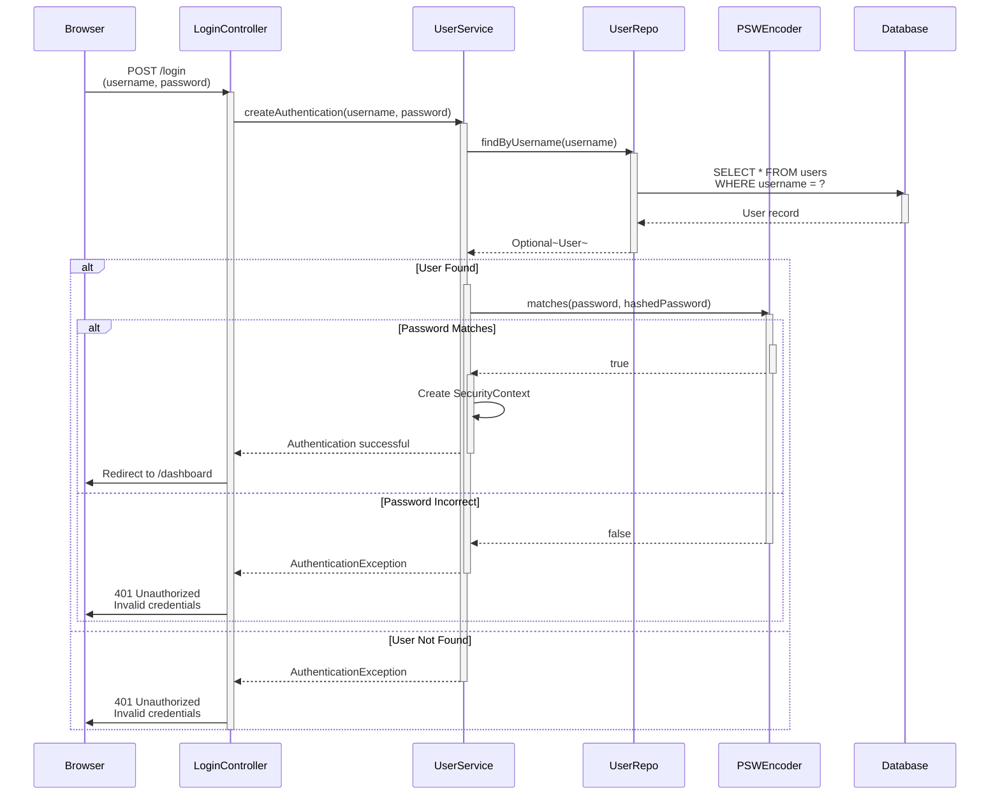

# Login Process - Activity Diagram

## Flusso delle Attività

| Fase | Attività | Descrizione |
|------|----------|-------------|
| **Input** | Inserimento credenziali | Utente compila form con username e password |
| **Validazione Username** | Verifica esistenza | Controlla se l'utente esiste nel DB |
| **Validazione Password** | Verifica correttezza | Usa PSWEncoder per verificare la password |
| **Validazione Ruolo** | Controlla permessi | Verifica che l'account sia attivo e abilitato |
| **Creazione Contesto** | SecurityContext | Crea sessione di autenticazione |
| **Salvataggio Sessione** | Session Management | Memorizza i dati di sessione |
| **Reindirizzamento** | Navigation | Invia l'utente al dashboard |

## Punti di Fallimento

1. **Username non trovato** → Torna a /login con errore
2. **Password incorretta** → Torna a /login con errore
3. **Account disabilitato** → Accesso negato anche se credenziali corrette

---

## Login Process - Sequence Diagram

## Descrizione Flusso

1. **Browser** → Invia credenziali (username, password) al LoginController
2. **LoginController** → Delega a UserService il processo di autenticazione
3. **UserService** → Richiede l'utente al database tramite UserRepo
4. **UserRepo** → Esegue query sul database
5. **PSWEncoder** → Verifica che la password inserita corrisponda all'hash memorizzato
6. **Esito**:
   - ✅ **Successo**: Crea SecurityContext e reindirizza a /dashboard
   - ❌ **Fallimento**: Ritorna 401 Unauthorized

## Componenti Coinvolti

| Componente | Ruolo |
|-----------|-------|
| **LoginController** | Gestisce le richieste di login dal browser |
| **UserService** | Logica di autenticazione e validazione |
| **UserRepo** | Accesso ai dati utente dal database |
| **PSWEncoder** | Verifica le password usando BCrypt |
| **SecurityConfig** | Configurazione di Spring Security (non mostrato) |
