# Menu Display Flow - Activity Diagram

## Flusso Visualizzazione Menu

| Fase | Componente | Azione |
|------|-----------|--------|
| Request | Browser | Richiesta GET /menu |
| Controller | PublicController | Riceve richiesta GET |
| Service | DishService | Recupera piatti attivi |
| Repository | DishRepo | Query SELECT con filtro active=true |
| Database | Database | Ritorna lista piatti |
| Mapping | DishMapper | Converte entities in DTO |
| View | Thymeleaf | Renderizza template menu.html |
| Styling | CSS | Applica style.css + menu.css |
| Output | Browser | Visualizza menu formattato |

## Colori CSS Utilizzati

- **style.css** - Stili globali della pagina
- **menu.css** - Stili specifici del menu (layout piatti, prezzi, descrizioni)

## Componenti Coinvolti

| Componente | Ruolo |
|-----------|-------|
| **PublicController** | Gestisce le richieste pubbliche (home, menu, contatti) |
| **DishService** | Logica di recupero e filtraggio dei piatti |
| **DishMapper** | Converte Dish entity in DTO |
| **DishRepo** | Accesso ai dati dei piatti dal database |
| **Thymeleaf** | Template engine per renderizzare l'HTML |
| **CSS Files** | Styling della pagina |

## File Coinvolti

- **menu.html** - Template della pagina menu
- **style.css** - Foglio di stile principale
- **menu.css** - Foglio di stile specifico per il menu

```mermaid
graph TD
    Start([Utente accede a /menu]) --> RequestGet["GET /menu"]
    RequestGet --> ReceiveCtrl2["PublicController<br/>riceve richiesta"]
    ReceiveCtrl2 --> CallService2["DishService<br/>getAvailableDishes()"]
    CallService2 --> QueryDB["DishRepo.findByActive(true)<br/>SELECT FROM dishes"]
    QueryDB --> LoadData["Piatti caricati dal DB"]
    LoadData --> CheckEmpty{"Ci sono<br/>piatti?"}
    
    CheckEmpty -->|No| ErrorEmpty["Menu temporaneamente vuoto"]
    ErrorEmpty --> ShowMsg["Mostra messaggio"]
    ShowMsg --> End1([Torna a home])
    
    CheckEmpty -->|Sì| MapToDTOs["DishMapper<br/>toDtoList(dishes)"]
    MapToDTOs --> DTOList["DishDTO list creato"]
    DTOList --> PassToView["Passa dati a Thymeleaf"]
    PassToView --> RenderTemplate["Thymeleaf renderizza<br/>menu.html"]
    RenderTemplate --> ApplyCSS["Applica CSS<br/>style.css + menu.css"]
    ApplyCSS --> ReturnHTML["Genera HTML response"]
    ReturnHTML --> BrowserDisplay["Browser visualizza menu"]
    BrowserDisplay --> End2(["Pagina menu caricata"])
    
    style Start stroke:#27AE60,stroke-width:2px
    style RequestGet stroke:#9B59B6,stroke-width:2px
    style ReceiveCtrl2 stroke:#F39C12,stroke-width:2px
    style CallService2 stroke:#1ABC9C,stroke-width:2px
    style QueryDB stroke:#E74C3C,stroke-width:2px
    style LoadData stroke:#4A90E2,stroke-width:2px
    style CheckEmpty stroke:#F39C12,stroke-width:2px
    style MapToDTOs stroke:#E67E22,stroke-width:2px
    style DTOList stroke:#27AE60,stroke-width:2px
    style PassToView stroke:#27AE60,stroke-width:2px
    style RenderTemplate stroke:#F39C12,stroke-width:2px
    style ApplyCSS stroke:#9B59B6,stroke-width:2px
    style ReturnHTML stroke:#4A90E2,stroke-width:2px
    style BrowserDisplay stroke:#F39C12,stroke-width:2px
    style ErrorEmpty stroke:#E74C3C,stroke-width:2px
    style ShowMsg stroke:#E74C3C,stroke-width:2px
    style End1 stroke:#E74C3C,stroke-width:2px
    style End2 stroke:#27AE60,stroke-width:2px
```

