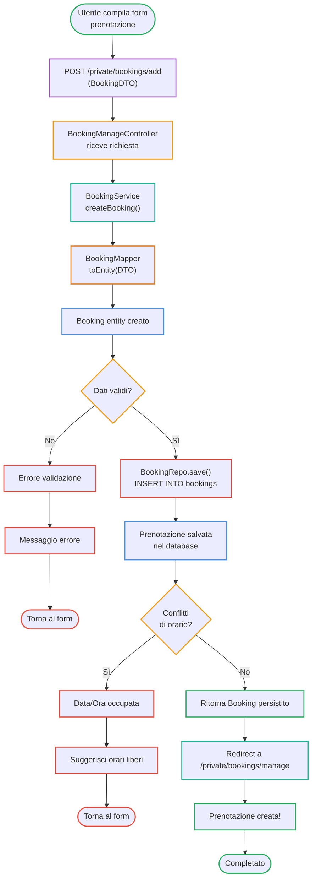

# Booking Creation Flow - Activity Diagram

## Flusso di Creazione Prenotazione

| Fase | Componente | Azione |
|------|-----------|--------|
| Input | Form HTML | Utente compila form con dati prenotazione |
| Controller | BookingManageController | Riceve richiesta POST |
| Service | BookingService | Avvia logica di business |
| Mapping | BookingMapper | Converte DTO in entity |
| Validazione | Service | Verifica dati (email, telefono, ospiti, ecc) |
| Database | BookingRepo | Salva nel database |
| Controllo | Service | Verifica conflitti di orario |
| Output | Controller | Redirige a gestione prenotazioni |

## Percorsi di Successo / Errori

- **Validation Error** → Mostra errore validazione
- **Time Conflict** → Suggerisce orari liberi
- **Success** → Prenotazione creata e visibile in gestione

## Componenti Coinvolti

| Componente | Ruolo |
|-----------|-------|
| **BookingManageController** | Gestisce le richieste di prenotazione |
| **BookingService** | Logica di creazione e validazione prenotazioni |
| **BookingMapper** | Converti BookingDTO in entity Booking |
| **BookingRepo** | Accesso ai dati di prenotazione dal database |
| **Database** | Persistenza delle prenotazioni |
