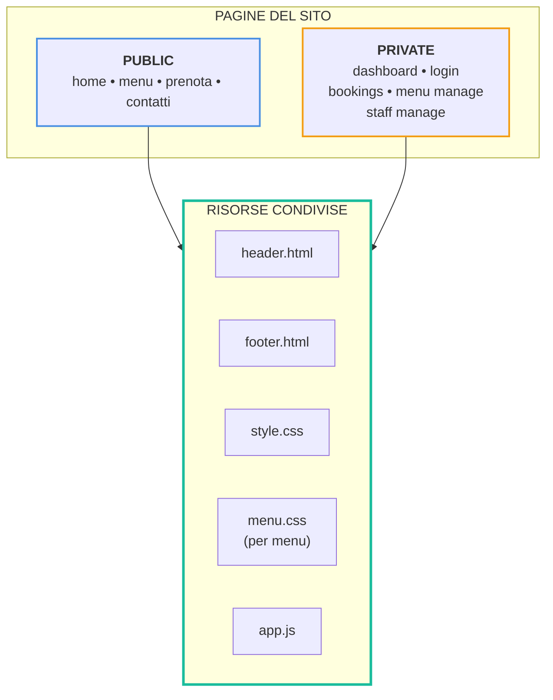

# Schema Classi CSS e Tag HTML

## Architettura Layout

### Dipendenze Dettagliate

**Tutte le pagine utilizzano:**
- **style.css** (foglio di stile principale)
- **header.html** (fragment di navigazione)
- **footer.html** (fragment footer)

**Pagine speciali:**
- **menu.html** e **menu/manage.html** → aggiungono **menu.css**

## Tabella Riepilogativa CSS

### menu.css
| Classe | Tag HTML |
|--------|----------|
| `.menu-page` | main |
| `.menu-container` | div |
| `.menu-subtitle` | p |
| `.menu-section` | section |
| `.dish-list` | ul |
| `.dish-item` | li |
| `.dish-info` | div |
| `.dish-name` | span |
| `.dish-dots` | span |
| `.dish-price` | span |
| `.dish-description` | p |

### style.css
| Classe | Tag HTML |
|--------|----------|
| `.navbar` | nav |
| `.logo` | div |
| `.nav-links` | ul |
| `.home` | section |
| `.home-content` | div |
| `.btn-main` | a |
| `.welcome` | section |
| `.container-welcome` | div |
| `.welcome-text` | div |
| `.welcome-image` | div |
| `.img-wrapper` | div |
| `.btn-secondary` | a |
| `.section-intro` | section |
| `.footer` | footer |
| `.footer-links` | div, ul |

## Dettaglio File HTML

### Public Pages

#### home.html
- **Percorso**: `templates/public/home.html`
- **CSS importati**: style.css
- **Fragment inclusi**: header.html, footer.html
- **Classi CSS principali**:
  - `.navbar`, `.logo`, `.nav-links` (da header)
  - `.home`, `.home-content`, `.btn-main`
  - `.welcome`, `.container-welcome`, `.welcome-text`
  - `.welcome-image`, `.img-wrapper`, `.btn-secondary`
  - `.section-intro`
  - `.footer`, `.footer-links` (da footer)

#### menu.html
- **Percorso**: `templates/public/menu.html`
- **CSS importati**: style.css, menu.css
- **Fragment inclusi**: header.html, footer.html
- **Classi CSS principali**:
  - `.navbar`, `.logo`, `.nav-links` (da header - style.css)
  - `.menu-page`, `.menu-container`, `.menu-subtitle`
  - `.menu-section`, `.dish-list`, `.dish-item`
  - `.dish-info`, `.dish-name`, `.dish-dots`, `.dish-price`, `.dish-description`
  - `.footer`, `.footer-links` (da footer - style.css)

#### prenota.html
- **Percorso**: `templates/public/prenota.html`
- **CSS importati**: style.css
- **Fragment inclusi**: header.html, footer.html
- **Descrizione**: Pagina di prenotazione/booking

#### contatti.html
- **Percorso**: `templates/public/contatti.html`
- **CSS importati**: style.css
- **Fragment inclusi**: header.html, footer.html
- **Descrizione**: Pagina dei contatti

### Private Pages

#### dashboard.html
- **Percorso**: `templates/private/dashboard.html`
- **CSS importati**: style.css
- **Fragment inclusi**: header.html, footer.html
- **Descrizione**: Dashboard principale per gli utenti autenticati

#### login.html
- **Percorso**: `templates/private/auth/login.html`
- **CSS importati**: style.css
- **Fragment inclusi**: header.html, footer.html
- **Descrizione**: Pagina di login

#### bookings/add.html
- **Percorso**: `templates/private/bookings/add.html`
- **CSS importati**: style.css
- **Fragment inclusi**: header.html, footer.html
- **Descrizione**: Form per aggiungere una nuova prenotazione

#### bookings/manage.html
- **Percorso**: `templates/private/bookings/manage.html`
- **CSS importati**: style.css
- **Fragment inclusi**: header.html, footer.html
- **Descrizione**: Gestione delle prenotazioni

#### menu/manage.html
- **Percorso**: `templates/private/menu/manage.html`
- **CSS importati**: style.css, menu.css
- **Fragment inclusi**: header.html, footer.html
- **Descrizione**: Gestione del menu (admin)

#### staff/manage.html
- **Percorso**: `templates/private/staff/manage.html`
- **CSS importati**: style.css
- **Fragment inclusi**: header.html, footer.html
- **Descrizione**: Gestione dello staff (admin)

### Fragments Comuni

#### header.html
- **Percorso**: `templates/fragments/header.html`
- **CSS importati**: style.css
- **Classi CSS utilizzate**: `.navbar`, `.logo`, `.nav-links`
- **Incluso da**: Tutte le pagine pubbliche e private

#### footer.html
- **Percorso**: `templates/fragments/footer.html`
- **CSS importati**: style.css
- **Classi CSS utilizzate**: `.footer`, `.footer-links`
- **Incluso da**: Tutte le pagine pubbliche e private

