# JavaBistrot - UML Class Diagram

```mermaid
classDiagram
    direction LR
    %% ============================================
    %% LAYER 1: ENTITIES & ENUMERATIONS
    %% ============================================
    class User {
        -Long id
        -String username
        -String password
        -Role role
        -Set~Booking~ bookings
        -Boolean active
        +getAuthorities() Collection
        +getPassword() String
        +getUsername() String
        +isAccountNonExpired() boolean
        +isAccountNonLocked() boolean
        +isCredentialsNonExpired() boolean
        +isEnabled() boolean
    }

    class Booking {
        -Long id
        -String customerName
        -String email
        -String phoneNumber
        -Integer numberOfGuests
        -LocalDateTime bookingDateTime
        -String notes
        -Set~User~ assignedWaiters
        -Boolean active
    }

    class Dish {
        -Long id
        -String name
        -String description
        -BigDecimal price
        -DishType type
        -Boolean active
    }

    class Role {
        <<enumeration>>
        WAITER
        MAITRE
    }

    class DishType {
        <<enumeration>>
        ANTIPASTO
        PRIMO
        SECONDO
        DOLCE
    }

    %% ============================================
    %% LAYER 2: DATA TRANSFER OBJECTS
    %% ============================================
    class UserDTO {
        <<record>>
        +Long id
        +String username
        +Role role
        +Boolean active
    }

    class BookingDTO {
        <<record>>
        +Long id
        +String customerName
        +String email
        +String phoneNumber
        +Integer numberOfGuests
        +LocalDateTime bookingDateTime
        +Set~Long~ assignedWaiterIds
        +String notes
    }

    class DishDTO {
        <<record>>
        +Long id
        +String name
        +String description
        +BigDecimal price
        +DishType type
        +Boolean active
    }

    %% ============================================
    %% LAYER 3: MAPPERS
    %% ============================================
    class UserMapper {
        <<Component>>
        +toEntity(UserDTO) User
        +toDto(User) UserDTO
    }

    class BookingMapper {
        <<Component>>
        +toEntity(BookingDTO) Booking
        +toDto(Booking) BookingDTO
    }

    class DishMapper {
        <<Component>>
        +toEntity(DishDTO) Dish
        +toDto(Dish) DishDTO
    }

    %% ============================================
    %% LAYER 4: REPOSITORIES
    %% ============================================
    class UserRepo {
        <<interface>>
        <<JpaRepository>>
        +findByUsername(String) Optional~User~
    }

    class BookingRepo {
        <<interface>>
        <<JpaRepository>>
        +findByBookingDateTimeBetween(LocalDateTime, LocalDateTime) List~Booking~
        +findByCustomerNameContainingIgnoreCase(String) List~Booking~
        +findByPhoneNumber(String) List~Booking~
        +findByEmail(String) List~Booking~
    }

    class DishRepo {
        <<interface>>
        <<JpaRepository>>
        +findByType(DishType) List~Dish~
        +findByActive(Boolean) List~Dish~
    }

    %% ============================================
    %% LAYER 5: SERVICES
    %% ============================================
    class UserService {
        <<Service>>
        +createUser(UserDTO) User
        +updateUser(Long, UserDTO) User
        +deleteUser(Long) void
        +getUserById(Long) User
        +getAllUsers() List~User~
    }

    class BookingService {
        <<Service>>
        +createBooking(BookingDTO) Booking
        +updateBooking(Long, BookingDTO) Booking
        +deleteBooking(Long) void
        +getBookingById(Long) Booking
        +getAvailableBookings() List~Booking~
        +assignWaiterToBooking(Long, Long) void
    }

    class DishService {
        <<Service>>
        +createDish(DishDTO) Dish
        +updateDish(Long, DishDTO) Dish
        +deleteDish(Long) void
        +getDishById(Long) Dish
        +getDishesByType(DishType) List~Dish~
        +getAvailableDishes() List~Dish~
    }

    %% ============================================
    %% LAYER 6: CONTROLLERS
    %% ============================================
    class LoginController {
        <<Controller>>
        +loginPage() String
        +handleLogin(String, String) String
        +logout() String
    }

    class PublicController {
        <<Controller>>
        +home() String
        +menu() String
        +contacts() String
        +booking() String
    }

    class BookingManageController {
        <<Controller>>
        +managePage() String
        +addBooking() String
        +updateBooking(Long) String
    }

    class MenuManageController {
        <<Controller>>
        +managePage() String
        +addDish() String
        +editDish(Long) String
    }

    class StaffController {
        <<Controller>>
        +managePage() String
        +addStaff() String
        +editStaff(Long) String
    }

    class BookingRESTController {
        <<RestController>>
        +createBooking(BookingDTO) ResponseEntity~Booking~
        +updateBooking(Long, BookingDTO) ResponseEntity~Booking~
        +getBooking(Long) ResponseEntity~Booking~
        +deleteBooking(Long) ResponseEntity~Void~
    }

    class UserRESTController {
        <<RestController>>
        +createUser(UserDTO) ResponseEntity~User~
        +updateUser(Long, UserDTO) ResponseEntity~User~
        +getUser(Long) ResponseEntity~User~
        +deleteUser(Long) ResponseEntity~Void~
    }

    %% ============================================
    %% RELATIONSHIPS
    %% ============================================
    
    %% Entity relationships
    User "1" -- "*" Booking: assignedWaiters
    User --> Role: uses
    Dish --> DishType: type
    
    %% DTO relationships
    UserDTO --|> User: maps to
    BookingDTO --|> Booking: maps to
    DishDTO --|> Dish: maps to
    
    %% Mapper relationships
    UserMapper --> User: converts
    UserMapper --> UserDTO: converts
    BookingMapper --> Booking: converts
    BookingMapper --> BookingDTO: converts
    DishMapper --> Dish: converts
    DishMapper --> DishDTO: converts
    
    %% Repository relationships
    UserRepo --> User: manages
    BookingRepo --> Booking: manages
    DishRepo --> Dish: manages
    
    %% Service relationships
    UserService --> UserRepo: uses
    UserService --> UserMapper: uses
    BookingService --> BookingRepo: uses
    BookingService --> BookingMapper: uses
    DishService --> DishRepo: uses
    DishService --> DishMapper: uses
    
    %% Controller relationships
    LoginController --> UserService: uses
    PublicController --> DishService: uses
    PublicController --> BookingService: uses
    BookingManageController --> BookingService: uses
    MenuManageController --> DishService: uses
    StaffController --> UserService: uses
    BookingRESTController --> BookingService: uses
    UserRESTController --> UserService: uses

    %% ============================================
    %% STYLING
    %% ============================================
    
    %% Entities - Blu
    style User stroke:#4A90E2,stroke-width:2px
    style Booking stroke:#4A90E2,stroke-width:2px
    style Dish stroke:#4A90E2,stroke-width:2px
    
    %% Enumerations - Viola
    style Role stroke:#9B59B6,stroke-width:2px
    style DishType stroke:#9B59B6,stroke-width:2px
    
    %% DTOs - Verde
    style UserDTO stroke:#27AE60,stroke-width:2px
    style BookingDTO stroke:#27AE60,stroke-width:2px
    style DishDTO stroke:#27AE60,stroke-width:2px
    
    %% Mappers - Arancione
    style UserMapper stroke:#E67E22,stroke-width:2px
    style BookingMapper stroke:#E67E22,stroke-width:2px
    style DishMapper stroke:#E67E22,stroke-width:2px
    
    %% Repositories - Rosso
    style UserRepo stroke:#E74C3C,stroke-width:2px
    style BookingRepo stroke:#E74C3C,stroke-width:2px
    style DishRepo stroke:#E74C3C,stroke-width:2px
    
    %% Services - Ciano
    style UserService stroke:#1ABC9C,stroke-width:2px
    style BookingService stroke:#1ABC9C,stroke-width:2px
    style DishService stroke:#1ABC9C,stroke-width:2px
    
    %% Controllers - Giallo
    style LoginController stroke:#F39C12,stroke-width:2px
    style PublicController stroke:#F39C12,stroke-width:2px
    style BookingManageController stroke:#F39C12,stroke-width:2px
    style MenuManageController stroke:#F39C12,stroke-width:2px
    style StaffController stroke:#F39C12,stroke-width:2px
    style BookingRESTController stroke:#F39C12,stroke-width:2px
    style UserRESTController stroke:#F39C12,stroke-width:2px
```

## Descrizione dei Componenti

### Entità (Entities) - Blu
- **User**: Rappresenta un utente del sistema (cameriere o maître). Implementa `UserDetails` per la sicurezza Spring.
- **Booking**: Rappresenta una prenotazione al ristorante.
- **Dish**: Rappresenta un piatto del menu.

### Enumerazioni (Enumerations) - Viola
- **Role**: Enum che definisce i ruoli disponibili (WAITER, MAITRE).
- **DishType**: Enum che definisce i tipi di piatto (ANTIPASTO, PRIMO, SECONDO, DOLCE).

### DTO (Data Transfer Objects) - Verde
- **UserDTO**: Record per trasferire dati utente tra client e server.
- **BookingDTO**: Record per trasferire dati di prenotazione tra client e server.
- **DishDTO**: Record per trasferire dati di piatto tra client e server.

### Mapper - Arancione
- **UserMapper**: Converte tra `User` e `UserDTO`.
- **BookingMapper**: Converte tra `Booking` e `BookingDTO`.
- **DishMapper**: Converte tra `Dish` e `DishDTO`.

### Repository - Rosso
- **UserRepo**: Interfaccia JpaRepository per operazioni CRUD su User.
- **BookingRepo**: Interfaccia JpaRepository per operazioni CRUD su Booking con query personalizzate.
- **DishRepo**: Interfaccia JpaRepository per operazioni CRUD su Dish.

### Service - Ciano
- **UserService**: Gestisce la logica di business degli utenti.
- **BookingService**: Gestisce la logica di business delle prenotazioni.
- **DishService**: Gestisce la logica di business dei piatti.

### Controller - Giallo
**Controller MVC:**
- **LoginController**: Gestisce l'autenticazione e il login.
- **PublicController**: Gestisce le pagine pubbliche (home, menu, prenotazioni, contatti).
- **BookingManageController**: Gestisce la gestione delle prenotazioni.
- **MenuManageController**: Gestisce la gestione del menu (piatti).
- **StaffController**: Gestisce la gestione dello staff.

**REST Controller:**
- **BookingRESTController**: API REST per le operazioni CRUD su bookings.
- **UserRESTController**: API REST per le operazioni CRUD su users.

### Relazioni Principali
- Una **Booking** è assegnata a **User** (relazione ManyToMany via tabella `booking_waiters`)
- Un **User** può creare/modificare **Dish** (relazione OneToMany)
- **User** utilizza **Role** come enum
- **Dish** utilizza **DishType** come enum
- I **Mapper** convertono tra Entity e DTO
- I **Repository** gestiscono l'accesso ai dati
- I **Service** utilizzano Repository e Mapper per la logica di business
- I **Controller** utilizzano i Service per processare le richieste
