# UI Flows - JavaBistrot

Documentazione dei flussi principali dell'interfaccia utente dell'applicazione JavaBistrot.

---

## Login (PRIMARY FLOW)

**Descrizione**: Utente non autenticato accede alla pagina di login, inserisce credenziali e effettua l'accesso.

**Rotte coinvolte**:
1. GET /auth/login (form)
2. POST /login (submit tramite Spring Security)
3. SUCCESS → redirect a /dashboard / FAIL → messaggio errore

### Sequence Diagram

### Descrizione Dettagliata

| Passo | Azione | Componente | Descrizione |
|-------|--------|-----------|-------------|
| 1 | **Visualizza Form** | LoginPage | Utente accede a /auth/login e vede il form di login |
| 2 | **Richiesta Form** | Browser | GET request al server |
| 3 | **Carica Form** | LoginController | Ritorna il template di login con eventuali messaggi di errore |
| 4 | **Input Credenziali** | Form HTML | Utente inserisce username e password |
| 5 | **Submit** | Browser | POST request con credenziali verso endpoint /login |
| 6 | **Verifica** | UserService | Ricerca username nel database |
| 7 | **Validazione Password** | PSWEncoder | Verifica password con BCrypt |
| 8a | **✅ Successo** | SecurityContext | Crea sessione autenticata, reindirizza a /dashboard |
| 8b | **❌ Errore** | LoginController | Torna a login con messaggio di errore |

### ⚙️ Componenti Coinvolti

| Componente | Ruolo |
|-----------|-------|
| **LoginController** | Gestisce GET /auth/login e POST /login |
| **UserService** | Logica di autenticazione |
| **UserRepo** | Accesso alle credenziali nel DB |
| **PSWEncoder** | Verifica password con BCrypt |
| **SecurityConfig** | Configurazione Spring Security |

---

## 📋 Flusso 2: CRUD Prenotazioni (ADMIN/USER FLOW)

**Descrizione**: Utente autenticato visualizza, crea, modifica e elimina prenotazioni.

**Rotte coinvolte**:
1. GET /bookings/manage (lista)
2. GET /bookings/add (form creazione)
3. POST /bookings/add (salva)
4. GET /bookings/edit (form modifica)
5. POST /bookings/update (aggiorna)
6. POST /bookings/delete (elimina)

### Activity Diagram - CRUD Prenotazioni

```mermaid
graph TD
    Start([👤 Utente loggato]) --> ListEnd["GET /bookings/manage"]
    
    ListEnd --> ShowList["📋 Visualizza lista<br/>prenotazioni"]
    ShowList --> ActionChoice{"Azione?"}
    
    ActionChoice -->|Crea nuova| CreateForm["GET /bookings/add<br/>📝 Form creazione"]
    CreateForm --> FillForm["Compila dati<br/>(cliente, data, ospiti)"]
    FillForm --> CreateSub["POST /bookings/add"]
    CreateSub --> ValidateC{"✅ Dati validi?"}
    
    ValidateC -->|No| ErrorC["⚠️ Errore validazione"]
    ErrorC --> CreateForm
    
    ValidateC -->|Sì| CheckConflictC{"⚫ Orario<br/>disponibile?"}
    CheckConflictC -->|No| ConflictC["⚠️ Data occupata"]
    ConflictC --> CreateForm
    
    CheckConflictC -->|Sì| SaveC["💾 Salva nel DB"]
    SaveC --> SuccessC["✅ Prenotazione creata!"]
    SuccessC --> ListEnd
    
    ActionChoice -->|Modifica| EditForm["GET /bookings/edit/:id<br/>📝 Form modifica"]
    EditForm --> FillEdit["Modifica dati"]
    FillEdit --> UpdateSub["POST /bookings/update"]
    UpdateSub --> ValidateU{"✅ Dati validi?"}
    
    ValidateU -->|No| ErrorU["⚠️ Errore validazione"]
    ErrorU --> EditForm
    
    ValidateU -->|Sì| CheckConflictU{"⚫ Orario<br/>disponibile?"}
    CheckConflictU -->|No| ConflictU["⚠️ Data occupata"]
    ConflictU --> EditForm
    
    CheckConflictU -->|Sì| SaveU["💾 Aggiorna nel DB"]
    SaveU --> SuccessU["✅ Prenotazione aggiornata!"]
    SuccessU --> ListEnd
    
    ActionChoice -->|Elimina| DeleteConfirm["🗑️ Conferma eliminazione"]
    DeleteConfirm --> DeleteSubmit["POST /bookings/delete/:id"]
    DeleteSubmit --> SaveD["💾 Elimina dal DB"]
    SaveD --> SuccessD["✅ Prenotazione eliminata!"]
    SuccessD --> ListEnd
    
    ActionChoice -->|Esci| End([✔️ Chiudi])
    
    style Start fill:#27AE60,stroke:#27AE60,stroke-width:2px,color:#fff
    style ListEnd fill:#4A90E2,stroke:#4A90E2,stroke-width:2px,color:#fff
    style ShowList fill:#4A90E2,stroke:#4A90E2,stroke-width:2px,color:#fff
    style ActionChoice fill:#F39C12,stroke:#F39C12,stroke-width:2px,color:#fff
    
    style CreateForm stroke:#1ABC9C,stroke-width:2px
    style EditForm stroke:#1ABC9C,stroke-width:2px
    style FillForm stroke:#9B59B6,stroke-width:2px
    style FillEdit stroke:#9B59B6,stroke-width:2px
    
    style CreateSub stroke:#E67E22,stroke-width:2px
    style UpdateSub stroke:#E67E22,stroke-width:2px
    style DeleteSubmit stroke:#E74C3C,stroke-width:2px
    
    style ValidateC stroke:#F39C12,stroke-width:2px
    style ValidateU stroke:#F39C12,stroke-width:2px
    style CheckConflictC stroke:#F39C12,stroke-width:2px
    style CheckConflictU stroke:#F39C12,stroke-width:2px
    style DeleteConfirm stroke:#F39C12,stroke-width:2px
    
    style ErrorC stroke:#E74C3C,stroke-width:2px,color:#fff
    style ErrorU stroke:#E74C3C,stroke-width:2px,color:#fff
    style ConflictC stroke:#E74C3C,stroke-width:2px,color:#fff
    style ConflictU stroke:#E74C3C,stroke-width:2px,color:#fff
    
    style SaveC stroke:#E74C3C,stroke-width:2px
    style SaveU stroke:#E74C3C,stroke-width:2px
    style SaveD stroke:#E74C3C,stroke-width:2px
    
    style SuccessC fill:#27AE60,stroke:#27AE60,stroke-width:2px,color:#fff
    style SuccessU fill:#27AE60,stroke:#27AE60,stroke-width:2px,color:#fff
    style SuccessD fill:#27AE60,stroke:#27AE60,stroke-width:2px,color:#fff
    style End fill:#27AE60,stroke:#27AE60,stroke-width:2px,color:#fff
```

### Sequence Diagram - CREATE

### Componenti Coinvolti

| Componente | Ruolo |
|-----------|-------|
| **BookingManageController** | Gestisce le rotte GET/POST per CRUD |
| **BookingService** | Logica di validazione e business |
| **BookingMapper** | Converte BookingDTO ↔ Booking entity |
| **BookingRepo** | Accesso al database |

---

## 🍽️ Flusso 3: CRUD Menu (ADMIN ONLY)

**Descrizione**: Admin visualizza, crea, modifica e elimina piatti del menu.

**Rotte coinvolte**:
1. GET /menu/manage (lista)
2. GET /menu/add (form)
3. POST /menu/add (salva)
4. GET /menu/edit (modifica)
5. POST /menu/update (aggiorna)
6. POST /menu/delete (elimina)

### Flow Diagram

```mermaid
graph TD
    Start([👨‍💼 Admin loggato]) --> List["GET /menu/manage<br/>📋 Lista piatti"]
    List --> Show["Visualizza piatti<br/>organizzati per tipo"]
    Show --> Action{"Azione?"}
    
    Action -->|Crea| AddForm["GET /menu/add<br/>📝 Form nuovo piatto"]
    AddForm --> Fill["Compila:<br/>nome, desc, prezzo, tipo"]
    Fill --> PostAdd["POST /menu/add"]
    PostAdd --> Validate1{"✅ Valido?"}
    Validate1 -->|No| Error1["⚠️ Errore"]
    Error1 --> AddForm
    Validate1 -->|Sì| Save1["💾 Salva"]
    Save1 --> OK1["✅ Piatto aggiunto"]
    OK1 --> List
    
    Action -->|Modifica| EditForm["GET /menu/edit/:id<br/>📝 Form modifica"]
    EditForm --> FillEdit["Modifica dati"]
    FillEdit --> PostEdit["POST /menu/update"]
    PostEdit --> Validate2{"✅ Valido?"}
    Validate2 -->|No| Error2["⚠️ Errore"]
    Error2 --> EditForm
    Validate2 -->|Sì| Save2["💾 Aggiorna"]
    Save2 --> OK2["✅ Piatto aggiornato"]
    OK2 --> List
    
    Action -->|Disabilita| Delete["POST /menu/delete/:id<br/>🗑️"]
    Delete --> Confirm["Conferma eliminazione"]
    Confirm --> Save3["💾 Disabilita"]
    Save3 --> OK3["✅ Piatto rimosso"]
    OK3 --> List
    
    Action -->|Esci| End(["✔️ Fine"])
    
    style Start fill:#27AE60,stroke:#27AE60,stroke-width:2px,color:#fff
    style List fill:#4A90E2,stroke:#4A90E2,stroke-width:2px,color:#fff
    style Show fill:#4A90E2,stroke:#4A90E2,stroke-width:2px,color:#fff
    style Action fill:#F39C12,stroke:#F39C12,stroke-width:2px,color:#fff
    style AddForm stroke:#1ABC9C,stroke-width:2px
    style EditForm stroke:#1ABC9C,stroke-width:2px
    style Validate1 fill:#F39C12,stroke:#F39C12,stroke-width:2px,color:#fff
    style Validate2 fill:#F39C12,stroke:#F39C12,stroke-width:2px,color:#fff
    style OK1 fill:#27AE60,stroke:#27AE60,stroke-width:2px,color:#fff
    style OK2 fill:#27AE60,stroke:#27AE60,stroke-width:2px,color:#fff
    style OK3 fill:#27AE60,stroke:#27AE60,stroke-width:2px,color:#fff
    style End fill:#27AE60,stroke:#27AE60,stroke-width:2px,color:#fff
```

---

## 👥 Flusso 4: CRUD Staff (ADMIN ONLY)

**Descrizione**: Admin gestisce il personale (camerieri, maîtres).

**Rotte coinvolte**:
1. GET /staff/manage (lista)
2. GET /staff/add (form)
3. POST /staff/add (crea)
4. GET /staff/edit (modifica)
5. POST /staff/update (aggiorna)
6. POST /staff/delete (elimina)

### Quick Flow

```mermaid
graph LR
    Start([👨‍💼 Admin]) --> List["📋 GET /staff/manage"]
    List --> Show["Visualizza camerieri<br/>e maîtres"]
    Show --> Action{"Azione?"}
    
    Action -->|Aggiungi| Add["➕ Crea staff<br/>POST /staff/add"]
    Action -->|Modifica| Edit["✏️ Edita staff<br/>POST /staff/update"]
    Action -->|Rimuovi| Del["🗑️ Elimina staff<br/>POST /staff/delete"]
    
    Add --> OK["✅ Aggiunto"]
    Edit --> OK
    Del --> OK
    
    OK --> List
    Action -->|Esci| End(["✔️ Fine"])
    
    style Start fill:#27AE60,stroke:#27AE60,stroke-width:2px,color:#fff
    style List fill:#4A90E2,stroke:#4A90E2,stroke-width:2px,color:#fff
    style Action fill:#F39C12,stroke:#F39C12,stroke-width:2px,color:#fff
    style Add stroke:#1ABC9C,stroke-width:2px
    style Edit stroke:#1ABC9C,stroke-width:2px
    style Del stroke:#E74C3C,stroke-width:2px
    style OK fill:#27AE60,stroke:#27AE60,stroke-width:2px,color:#fff
    style End fill:#27AE60,stroke:#27AE60,stroke-width:2px,color:#fff
```

---

## 🎯 Riepilogo Flussi

| Flusso | Tipo | Primary | Utenti | Complessità |
|--------|------|---------|--------|-------------|
| **Login** | Authentication | ✅ Sì | Tutti | Alta |
| **CRUD Prenotazioni** | Business Logic | ✅ Sì | USER, ADMIN | Alta |
| **CRUD Menu** | Management | Extra | ADMIN | Media |
| **CRUD Staff** | Management | Extra | ADMIN | Media |

---

## 🎨 Legenda Colori

| Colore | Significato | UML |
|--------|-------------|-----|
| 🟢 Verde (#27AE60) | Start, Success | DTOs |
| 🔵 Blu (#4A90E2) | GET Request, Visualizza | Entities |
| 🟡 Giallo (#F39C12) | Decisioni, Post | Controllers |
| 🔴 Rosso (#E74C3C) | Errori, Delete | Repositories |
| 🔷 Ciano (#1ABC9C) | Service, Form | Services |
| 🟣 Viola (#9B59B6) | Input, Modifica | Enumerazioni |
| 🟠 Arancione (#E67E22) | Mapper | Mappers |
